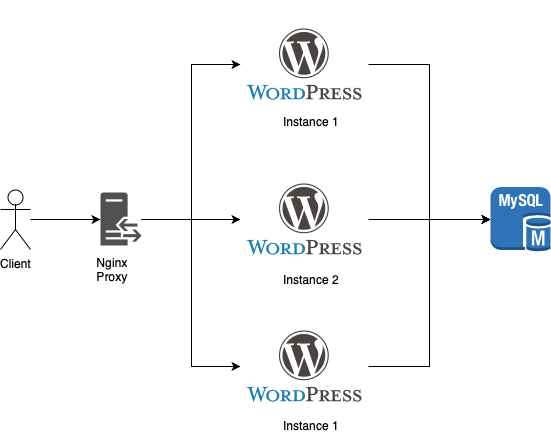

# docker-nginx
Docker NGINX load balancer with WordPress and MySQL

## Scheme 



## How to use

```bash
$ cd docker
$ docker-compose up -d
```

* Open `http://localhost`
* Install e configure WordPress 

* The file `docker-composer.yaml` has configuration to create: - 1 Mysql - 3 Wordpress - 1 Nginx
* The wordrpress and nginx have volumes associated with local machine and docker container.


```yaml
version: '3'
services:
  db:
    image: mysql:5.5.60
    environment:
      MYSQL_DATABASE: wordpress
      MYSQL_ROOT_PASSWORD: w0rdpress
      MYSQL_USER: root
      
  wordpress1:
    #container_name: wordpress1
    image: wordpress:latest
    environment:
      WORDPRESS_DB_HOST: db
      WORDPRESS_DB_NAME: wordpress
      WORDPRESS_DB_USER: root
      WORDPRESS_DB_PASSWORD: w0rdpress
    volumes: 
      - ./wordpress:/var/www/html
    depends_on:
      - db
  wordpress2:
    #container_name: wordpress2
    image: wordpress:latest
    environment:
      WORDPRESS_DB_HOST: db
      WORDPRESS_DB_NAME: wordpress
      WORDPRESS_DB_USER: root
      WORDPRESS_DB_PASSWORD: w0rdpress
    volumes: 
      - ./wordpress:/var/www/html
    depends_on:
      - db  
  wordpress3:
    #container_name: wordpress2
    image: wordpress:latest
    environment:
      WORDPRESS_DB_HOST: db
      WORDPRESS_DB_NAME: wordpress
      WORDPRESS_DB_USER: root
      WORDPRESS_DB_PASSWORD: w0rdpress
    volumes: 
      - ./wordpress:/var/www/html
    depends_on:
      - db       
  nginx:
    image: nginx:latest
    restart: always
    volumes:
      - ./nginx.conf:/etc/nginx/nginx.conf:ro
      - ./nginx/log:/var/log/nginx      
    ports:
      - 80:80
      - 443:443
    depends_on:
      - wordpress1
      - wordpress2
      - wordpress3                           
```

* The file `nginx.conf` has configurations for nginx:

```conf
events { worker_connections 2048; }

http { 
  upstream localhost { #  server address poll 
      server docker_wordpress1_1;
      server docker_wordpress2_1;
      server docker_wordpress3_1;      
  }
  
  server { # server configuration
      listen 80 default_server; # default port 80:80
      listen [::]:80 default_server;

      root /usr/share/nginx/html;
      index index.php;

      location / { # pass all requests to the upstream addresses
        proxy_pass  http://localhost; 
        add_header X-Upstream $upstream_addr; # adds the Host header with the value the configured upstream addresses array
      }
  }
}

```